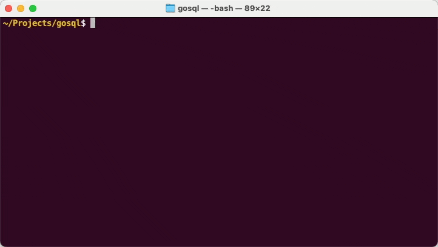
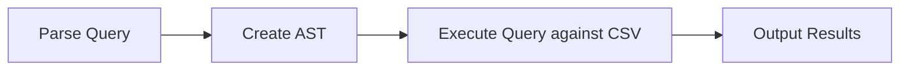

# GoSQL

A basic SQL query engine in Go 
- It can parse and execute simple SQL queries on CSV files
- Supports SELECT, FROM, WHERE, and LIMIT clauses.



## Architecture

The program is simple:


An AST is an Abstract Syntax Tree. It is a tree representation of the structure of the SQL query, eg

```json
{
    "type": "SELECT",
    "value": ["first_name", "last_name"]
},
{
    "type": "FROM",
    "value": "data/addresses"
},
{
    "type": "WHERE",
    "left": "first_name",
    "operator": "=",
    "right": "John"
}
```


## Installation

1. Ensure you have Go installed on your system.
2. Clone this repository:
   ```bash
   git clone https://github.com/archiewood/gosql.git
   cd gosql
   ```
3. Build the project:
   ```bash
   go build
   ```

## Usage

Run the program with your SQL query as an argument:

```bash
./gosql "SELECT column1, column2 FROM table WHERE column3 = 'value' LIMIT 10"
```

The program expects CSV files to be relative to the directory from which you run the program, named as `<table>.csv`. You can use unix paths eg 

```bash
./gosql "SELECT * FROM data/wait_times"
```

### Flags

- `-ast`: Print the Abstract Syntax Tree of the query

Example:
```bash
./gosql -ast "SELECT * FROM users WHERE country = 'USA' LIMIT 5"
```

## Friendly Syntax
- `SELECT` not required, * assumed if not specified
- Trailing commas after final select clause are allowed